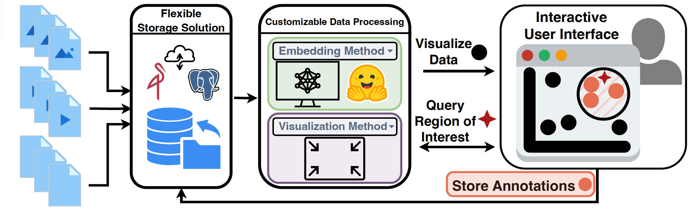

# Spacewalker \[[arxiv](https://arxiv.org/abs/2409.16793)\]

<p align="center">
  
</p>

⚠️ **DO NOT** use this repository "as is" in production, do not use dummy credentials.

## Overview

<p align="center">
  
</p>

Spacewalker is a deep learning-based framework designed for interactive exploration and annotation of various data modalities, including images, text, and video. It leverages state-of-the-art models and dimensionality reduction methods to produce visualizations of the embedding space that users can explore interactively.

<p align="center">
  
</p>

## Key Features
- **Feature-Space based**: Explore how samples are related to each other and annotate directly in the reduced representation of the feature space!
- **Multi-Modal Support**: Process images, text, and video data seamlessly.
- **Efficient Inference**: Optimized for fast inference using NVIDIA Triton Inference Server.
- **User-Friendly Interface**: Built with Django for easy interaction and configuration.

## Prerequisites
- [Docker](https://www.docker.com/get-started/)
- Optional: VS Code + Docker Plugin for development
- Recommended: CUDA-compatible GPU for Triton. If unavailable, CPU will be used.

## Getting Started
1. Clone or download this repository.
2. Download the `model_repository` folder ([link](https://drive.google.com/file/d/1uBhl4AGDSbxDxMzA2hMVwoC-MMO93nJw/view?usp=share_link)), unzip, and place it inside the root folder of this repository. The directory structure should look like this:
   ```
   Spacewalker/
   ├── .devcontainer
   ├── backend
   ├── environments
   ├── model_repository
   ├── Triton
   ├── .gitignore
   ├── docker-compose-develop.yml
   ├── docker-compose.yml
   ├── Dockerfile
   ├── inference-requests.py
   ├── LICENSE
   ├── manage.py
   ├── package-lock.json
   ├── package.json
   └── README.md
   ```
3. Ensure that Docker is running.
4. Run the following command:
   ```bash
   docker compose -f docker-compose.yml up --remove-orphans --force-recreate
   ```
5. Navigate to `http://0.0.0.0:8080` (`http://localhost:8080`).

## Services
The following services are exposed on their default ports:
- [NVIDIA Triton Inference Server](https://www.nvidia.com/en-us/ai-data-science/products/triton-inference-server/) (8000, 8001)
- [MinIO](https://min.io) (9000, 9001)
- Spacewalker (8080)

## Development
For development, you can use the following command:
```bash
docker compose -f docker-compose.yml -f docker-compose-develop.yml up --remove-orphans --force-recreate
```

### Frontend Development
1. Open the project in VS Code.
2. Open in `.devcontainer`.
3. Navigate to the frontend directory:
   ```bash
   cd frontend
   ```
4. Start the development server:
   ```bash
   npx parcel ./src/index.html --dist-dir=/workspaces/SpaceWalker/backend/static/frontend
   ```

## License
This project is licensed under the MIT License - see the [LICENSE](LICENSE) file for details.
